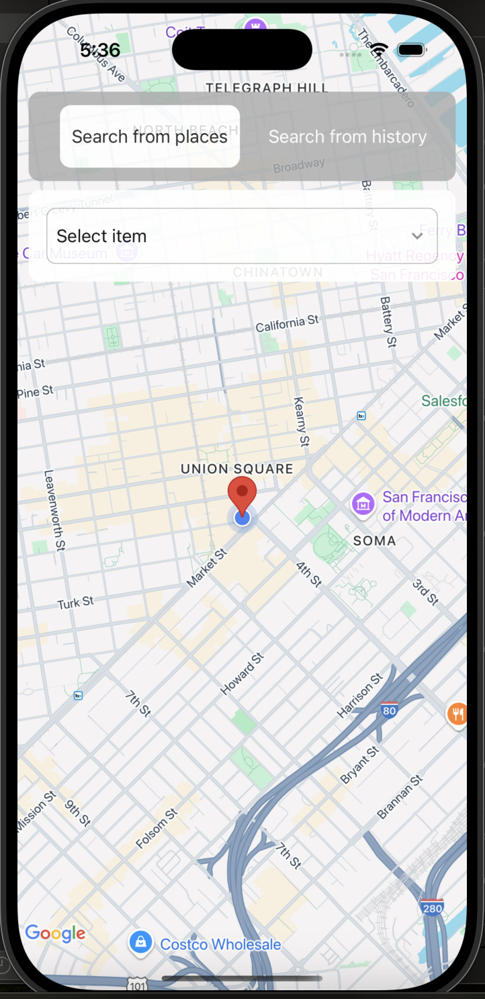
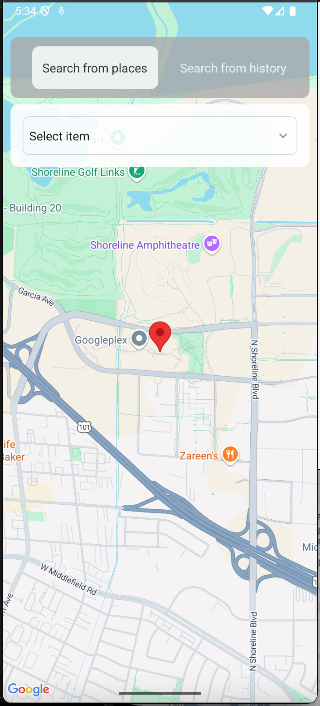

# 🌍 **Maplify**

Maplify is a React Native mobile application offering intuitive map-based functionalities, such as place search and history tracking.

---

## 🛠️ **Approach & Technical Choices**

### 🎨 **Atomic Design System**

The `component/` folder follows the **Atomic Design** methodology, organizing UI components into a hierarchy based on complexity and reusability:

- **Molecules**: Simple composite components formed by combining basic UI elements (e.g., buttons, dropdowns, loaders). These are functional units used throughout the app.
- **Organisms**: More complex UI blocks composed of molecules and other elements, representing full sections or modules (e.g., maps, tab groups, search bars).

This layered approach promotes consistency, scalability, and separation of concerns, making maintenance and testing easier.

---

## 🧠 **State Management**

Maplify uses the **React Context API** combined with custom reducers to manage global state across the app. This modular approach keeps the state predictable and avoids prop drilling, making the app scalable for larger features.

- **context/**: Provides shared application state via React Context Providers.
- **reducer/**: Defines pure functions to handle state updates based on dispatched actions.

---

## 🧱 **Project Structure**

The project follows a clear and modular folder structure:

```
.
├── component       # Atomic design-based UI components
├── constant        # App-wide constants and config
├── context         # React Contexts for global state
├── hook            # Custom React hooks
├── reducer         # Reducers for structured state updates
├── screen          # Application screens (e.g., Landing)
├── service         # External API integrations (e.g., Google)
├── theme           # Design tokens (color, font, spacing)
├── typing          # TypeScript types and interfaces
└── util            # Shared utility functions
```

---

## 🧹 **Code Quality & Consistency**

To maintain a clean and consistent codebase, the following tools are used:

- **ESLint**: Static code analysis for enforcing style and catching errors.
- **Prettier**: Opinionated code formatter.
- **Husky**: Git hooks to run checks before commits.
- **TypeScript (tsc)**: Ensures type safety by running type-checking during CI or pre-commit.
- **Test Runner (e.g., Jest)**: Runs unit and integration tests to ensure code reliability.

These tools ensure that every commit adheres to the project's coding standards automatically.
For running these explicitly you can go through `package.json` scripts

```sh
   npm run lint # for eslint
   npm run format # for prettier formatting
   npm run test:coverage # run test test and coverage
```

---

## 🧑‍💻 **Developer Experience**

- **Path Aliases**: Set up via `tsconfig.json` and `babel.config.js` to avoid long relative imports and improve code readability.  
  Example:  
  `import { Loader } from '@maplify/molecule'` instead of `../../../component/molecule`.

---

## ⚙️ **Getting Started**

> **Note**: Make sure you have completed the [Set Up Your Environment](https://reactnative.dev/docs/set-up-your-environment) guide before proceeding.

### Step 1: 🚧 **Pre-start**

Clone the project:

```sh
git clone https://github.com/saqlain11/Maplify.git
git checkout main
cd Maplify
```

Make sure you're using the correct Node version by running the following (based on `.nvmrc`):

```sh
nvm use # This will use the node version defined in the project.
```

---

### 🗺️ **For Google Maps**

To set up Google Maps:

- **For iOS**:  
  Go to the `ios/Maplify/AppDelegate.swift` file and paste your API key instead of `YOUR_API_KEY`.

- **For Android**:  
  Go to `android/src/main/AndroidManifest.xml` and paste your API key instead of `YOUR_API_KEY`.

#### 🚨 **Important Note**

Add a `.env` file in the root of the project with your Google Places API credentials:

```sh
BASE_URL=https://maps.googleapis.com/
API_KEY=YOUR_API_KEY
```

---

### Step 2: ▶️ **Start Metro**

Run **Metro**, the JavaScript bundler for React Native:

```sh
# Using npm
npm start

# OR using Yarn
yarn start
```

---

### Step 3: ⚙️ **Build and Run Your App**

With Metro running, open a new terminal window and use one of the following commands to build and run your Android or iOS app:

- **For Android**:

```sh
# Using npm
npm run android

# OR using Yarn
yarn android
```

- **For iOS**:

Make sure to install CocoaPods dependencies:

```sh
bundle install
bundle exec pod install
```

Then, build the app:

```sh
# Using npm
npm run ios

# OR using Yarn
yarn ios
```
Once you see the these screen 





## Congratulations! 🏆 you made it 🥳 👏


## Authors

[@Saqlain11](https://github.com/saqlain11)
